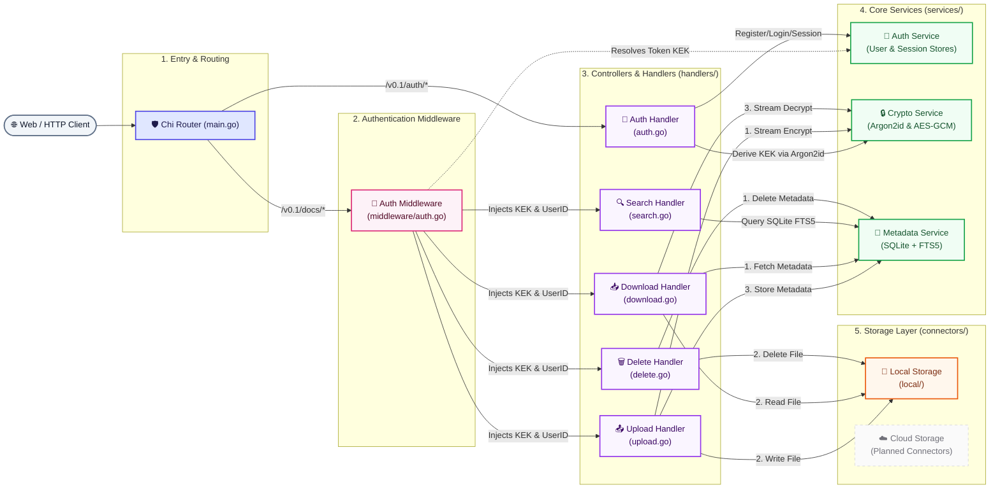
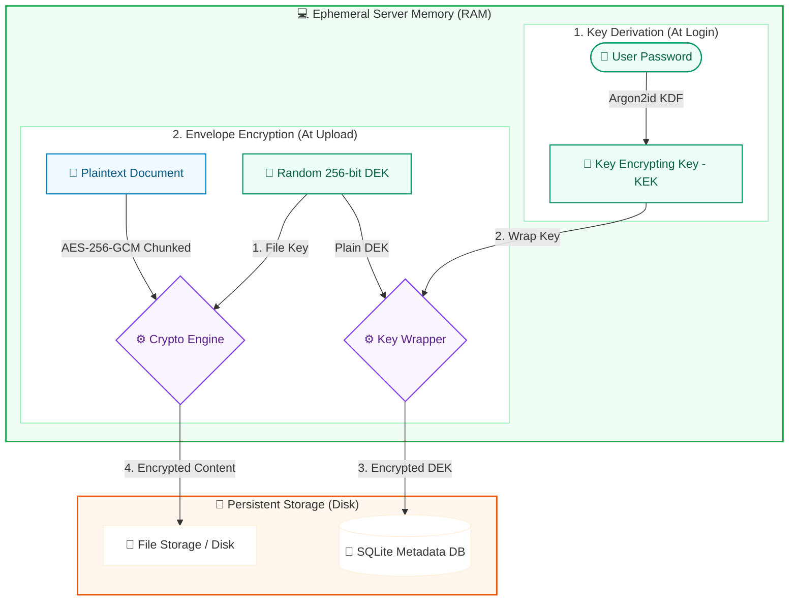
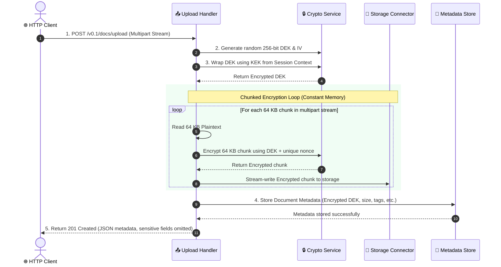

<p align="center">
  <h1 align="center">🔐 DocOps</h1>
  <p align="center">
    <strong>The encrypted document backend your application can actually search.</strong>
  </p>
  <p align="center">
    Store, search, and stream documents over a plain HTTP API — while remaining provably unable to read any of them at rest.
    Self-hosted. One container. Your storage.
  </p>
  <p align="center">
    <a href="#quickstart"><strong>Quickstart</strong></a> ·
    <a href="#features"><strong>Features</strong></a> ·
    <a href="#api-reference"><strong>API</strong></a> ·
    <a href="#configuration"><strong>Config</strong></a> ·
    <a href="#contributing"><strong>Contributing</strong></a>
  </p>
</p>

<br/>

<p align="center">
  
  
  
  
</p>

---

## Why DocOps?

Every option for handling sensitive documents forces a tradeoff:

| | Content private at rest? | Searchable? | Scriptable API? |
|:---|:---:|:---:|:---:|
| S3 / Google Drive (+ SSE) | ❌ *the provider holds the keys* | ✅ | ✅ |
| Cryptomator / VeraCrypt | ✅ | ❌ opaque blobs | ❌ |
| Nextcloud E2E encryption | ✅ | ❌ deliberately broken by E2E | ⚠️ |
| Roll it yourself (Tink, libsodium) | ⚠️ nonce-reuse bugs are career-shortening | ✅ | ✅ |
| **DocOps** | ✅ | ✅ FTS5 | ✅ REST + bearer keys |

**A database dump is not a breach.** Compromise DocOps' entire SQLite file and you walk away with salts and wrapped key blobs only — the Master Key exists solely in process RAM during active sessions, API-key secrets are stored as SHA-256, refresh tokens are hash-only, and every wrapped key is AAD-bound so even malicious database *writes* can't swap key material between rows undetected.

**It's boring infrastructure on purpose.** One container, one DB file, bring-your-own disk, MIT licensed. Humans authenticate with cookie sessions; machines use `docops_sk_…` bearer keys that work statelessly across restarts and revoke fail-closed in one call.

> [!IMPORTANT]
> **Honest scope:** document *content* is zero-knowledge; *metadata* (names, tags,
> extracted text) is stored in plaintext to power search. If you need E2E-encrypted
> metadata too, this isn't your tool — and we'd rather say so than oversell.

<details>
<summary><strong>The 60-second proof</strong> — run these four commands against any competitor's "encrypted storage"</summary>

```bash
# 1. Register and mint a machine credential
curl -X POST :8080/v0.1/auth/register -d '{"email":"a@b.c","password":"hunter2xx"}' -c c.txt
curl -X POST :8080/v0.1/auth/api-keys -b c.txt -d '{"name":"ci"}'

# 2. Upload a secret using the bearer key
curl -H "Authorization: Bearer docops_sk_…" -F file=@secret.pdf :8080/v0.1/docs/upload

# 3. Search finds it…
curl ":8080/v0.1/docs/search?q=secret" -b c.txt

# 4. …but the database has never seen plaintext:
sqlite3 docops.db "SELECT hex(encrypted_dek) FROM documents LIMIT 1"
strings docops.db | grep -i secret   # → no match
```

</details>

> [!NOTE]
> DocOps is in **active development (alpha)** — P0 hardening (atomic rotation, AAD
> binding, lazy KDF upgrades, API keys) is complete and battle-tested. Next up:
> cloud connectors, text extraction, OpenAPI/SDKs. See [ROADMAP.md](ROADMAP.md).

---

## Features

| Feature | Status | Description |
|:---|:---:|:---|
| 🔑 Envelope encryption | ✅ | Per-document AES-256-GCM keys, wrapped by a user-derived KEK |
| 🔒 Argon2id auth | ✅ | Independent salts + per-user persisted KDF params |
| 📈 Lazy KDF upgrade | ✅ | Strengthen config → users transparently rehash-and-rewrap at next login |
| 🔗 AAD-bound key wraps | ✅ | Swapped wrapped keys fail authentication (swap-attack tested) |
| ♻️ Atomic key rotation | ✅ | Master Key rotation commits all DEK re-wraps in one transaction; crash-safe |
| 🤖 API keys (`docops_sk_…`) | ✅ | Stateless bearer auth for machines — HKDF wrap tier, shown once, SHA-256 at rest, instant revocation |
| 🍪 JWT sessions | ✅ | HttpOnly/Secure/SameSite=Strict cookies, access (15m) + refresh (7d), revocable server-side |
| 💓 Durable refresh tokens | ✅ | Hash-only records — revocation & audit survive restarts, zero key material at rest |
| 🔍 Full-text search | ✅ | SQLite FTS5 with trigger-synced index |
| 📤 File upload | ✅ | Multipart upload with chunked streaming encryption (64 KB, constant memory) |
| 📥 File download | ✅ | DEK unwrap + chunked streaming decryption to client |
| ⏳ TTL enforcement | ✅ | Expired documents 404 like nonexistent ones + storage sweeper |
| 🏥 Health probes | ✅ | `/healthz` liveness, `/readyz` dependency-gated readiness |
| 🧾 Audit logging | ✅ | Structured security events — identifiers only, never secrets |
| 🛡️ Rate limiting | ✅ | IP fixed-window, trust-gated proxy headers, separate document-route ceiling |
| 👥 Multi-tenant | ✅ | All operations scoped by `user_id` in SQL |
| 💾 Local storage | ✅ | Filesystem connector with streaming I/O |
| ☁️ Cloud connectors | 🚧 | S3-compatible first (covers R2/MinIO/Spaces) |
| 📝 Text extraction | 🚧 | PDF/DOCX content extraction for search indexing |
| 📖 OpenAPI + SDKs | 🚧 | Spec-first generated clients |

---

## Architecture



---

## Security Model

DocOps uses **two-layer envelope encryption** so that compromising any single component does not expose plaintext documents:



| Property | Guarantee |
|:---|:---|
| **KEK storage** | Never written to disk — lives in server memory for session duration only |
| **DEK uniqueness** | Fresh 256-bit random key per document |
| **Nonce reuse** | Each encryption call generates a fresh random nonce |
| **Password hash vs KEK** | Independent Argon2id derivations with separate salts |
| **JWT contents** | Opaque session token only — no key material in the token |
| **Session revocation** | Server-side session store; logout invalidates immediately; refresh-token revocation survives restarts (hash-only durable records) |
| **Timing attacks** | Constant-time comparison for password verification and API-key secrets |
| **Key-wrap binding (AAD)** | Every wrapped key is cryptographically bound to its owner/document — swapped wraps fail authentication |
| **Rotation atomicity** | Master Key rotation commits all DEK re-wraps in one transaction; crash leaves the old state intact |
| **API keys** | Secret shown once, stored as SHA-256 only; stateless bearer auth; instant fail-closed revocation |

### Deliberate Tradeoffs

- **Register returns `409 Conflict` for duplicate emails.** This reveals that an email
  is registered to careful probing — accepted deliberately because registration is IP
  rate-limited and a stealthy fake-success would break the standard client contract
  (users would believe an account exists when it doesn't, or vice versa). Login remains
  fully enumeration-resistant (identical 401 for unknown user and wrong password).
- **Metadata is not encrypted.** Document names, tags, sizes, timestamps, and extracted
  text are stored in plaintext to power FTS5 search. *Content* is zero-knowledge;
  metadata is not.
- **Rate limiting trusts `RemoteAddr` by default.** `X-Forwarded-For` is honored only
  when `rate_limit.trust_proxy_headers: true` is set — enable it solely behind a proxy
  that overwrites those headers.


### Chunked Streaming Protocol

To ensure constant memory usage regardless of document size, DocOps processes all document uploads and downloads via a chunked streaming envelope encryption pipeline. Plaintext data is never held fully in memory or written to disk in its raw form:



---

## Quickstart

### Prerequisites

- **Go 1.25+**
- **CGO enabled** (required by `go-sqlite3`)
- **SQLite with FTS5** support (included in most distributions)

### Install & Run (Bare Metal)

The fastest way to set up the project locally is to run the automated setup command. It will check your Go toolchain and C compiler (GCC/Clang), configure dependencies, and automatically generate a secure `.env` file with a cryptographically random `JWT_SECRET`:

```bash
# Clone
git clone https://github.com/Kyei-Ernest/DocOps.git
cd DocOps

# Run automated setup
make setup

# Build
make build

# Run
make run
```

The server starts on `http://localhost:8080` by default. **All storage and database parent directories (e.g. `docops-data/`) are automatically created on startup.** No manual directory initialization or config file is required — sensible defaults are applied automatically.

### Run with Docker & Docker Compose

If you prefer to run DocOps without installing a Go toolchain or C compilers, you can build and start it using Docker in a single command:

1. **Run setup to generate a secure `.env` file:**
   ```bash
   make setup
   ```
   *(Alternatively, manually create a `.env` file containing `JWT_SECRET=your-random-32-byte-secret`)*

2. **Start the service:**
   ```bash
   docker compose up --build -d
   ```

The application will start on `http://localhost:8080`. All SQLite databases and uploaded files are securely persisted within a dedicated Docker volume named `docops-data`.


### Run Tests

```bash
# All tests
go test -tags "fts5" -v ./...

# By package
make services_crypto_test       # 25 tests — encryption, hashing, KEK/DEK, streaming
make services_metadata_test     # 15 tests — document CRUD, FTS5 search, isolation
make handler_test               # 68 tests — auth, upload, download, search, delete, recovery
make services_auth_user_test    #  3 tests — user persistence
make services_auth_session_test #  9 tests — session lifecycle, expiry, active GC
make auth_middleware_test        # 13 tests — JWT validation, rate limiting, context injection
make local_connector_test        #  7 tests — filesystem upload, download, delete
```

---

## API Reference

**Interactive documentation ships with the binary:**

| URL | What it is |
|:---|:---|
| [`/docs`](http://localhost:8080/docs) | Swagger UI — explore and try every endpoint |
| [`/redoc`](http://localhost:8080/redoc) | Redoc — three-panel reference view |
| `/openapi.yaml` | Raw OpenAPI 3.0 spec for codegen and tooling |

### Authentication

| Method | Endpoint | Description |
|:---|:---|:---|
| `POST` | `/v0.1/auth/register` | Create account — returns access + refresh cookies |
| `POST` | `/v0.1/auth/login` | Authenticate — returns access + refresh cookies |
| `POST` | `/v0.1/auth/refresh` | Exchange refresh cookie for new access cookie |
| `POST` | `/v0.1/auth/logout` | Revoke sessions and clear cookies |
| `POST` | `/v0.1/auth/recover` | Recover password using offline Recovery Key |
| `POST` | `/v0.1/auth/change-password` | Change password for authenticated users (protected) |
| `POST` | `/v0.1/auth/rotate-master-key` | Rotates the user's Master Key and re-encrypts all document keys (protected) |
| `POST` | `/v0.1/auth/api-keys` | Create machine credential — secret shown exactly once (protected) |
| `GET`  | `/v0.1/auth/api-keys` | List your API keys (metadata only) (protected) |
| `DELETE` | `/v0.1/auth/api-keys/{keyID}` | Revoke an API key (protected) |

#### API Keys

API keys authenticate **machines** (CI jobs, server-to-server integrations) without
passwords or sessions. Format: `docops_sk_<key_id>_<secret>`. The secret is a
32-byte CSPRNG value shown exactly once at creation and stored only as a SHA-256
hash; each key wraps your Master Key under its own HKDF-derived wrap key, so using
a key grants full document access for your account until revoked.

Because bearer authentication is **stateless**, machine traffic keeps working across
server restarts while human sessions still require re-login.

```bash
# Create a key (requires an authenticated cookie session)
curl -X POST http://localhost:8080/v0.1/auth/api-keys \
  -b cookies.txt -H 'Content-Type: application/json' \
  -d '{"name": "ci-bot"}'
# → {"api_key":"docops_sk_…","key_id":"…"}   ← store this now; it is never shown again

# Use it on any document route
curl -H "Authorization: Bearer docops_sk_…" \
  -F "file=@report.pdf" http://localhost:8080/v0.1/docs/upload

# Revoke — takes effect immediately, fail-closed
curl -X DELETE http://localhost:8080/v0.1/auth/api-keys/<key_id> -b cookies.txt
```

### Documents

| Method | Endpoint | Description |
|:---|:---|:---|
| `POST` | `/v0.1/docs/upload` | Upload encrypted document (multipart/form-data) |
| `GET`  | `/v0.1/docs/{docID}/download` | Download and decrypt a document (streaming) |
| `GET`  | `/v0.1/docs/search?q={query}` | Full-text search across document metadata |
| `DELETE`| `/v0.1/docs/{docID}` | Securely delete document metadata and storage file |

#### Upload Request

```bash
curl -X POST http://localhost:8080/v0.1/docs/upload \
  -b cookies.txt \
  -F "file=@document.pdf" \
  -F "tags=legal,2026"
```

#### Upload Response

```json
{
  "id": "doc_a1b2c3d4-...",
  "name": "document.pdf",
  "file_type": "application/pdf",
  "size_bytes": 104857,
  "encrypted": true,
  "tags": "legal,2026",
  "created_at": "2026-05-12T14:00:00Z"
}
```

#### Download Request

```bash
curl -X GET http://localhost:8080/v0.1/docs/doc_a1b2c3d4-.../download \
  -b cookies.txt \
  -o document.pdf
```

The response streams the decrypted file with appropriate `Content-Type` and `Content-Disposition` headers. Decryption happens in 64 KB chunks — memory usage is constant regardless of file size.

#### Search Request

```bash
curl -X GET "http://localhost:8080/v0.1/docs/search?q=quarterly" \
  -b cookies.txt
```

#### Search Response

```json
[
  {
    "id": "doc_a1b2c3d4-...",
    "name": "quarterly-report.pdf",
    "file_type": "application/pdf",
    "encrypted": true,
    "size_bytes": 104857,
    "tags": "finance,2026",
    "created_at": "2026-05-12T14:00:00Z",
    "expires_at": null
  }
]
```

Search matches against document names, tags, and extracted text via the FTS5 index. Results are scoped to the authenticated user — cross-tenant results are never returned. Sensitive internal fields (`storage_key`, `encrypted_dek`, `extracted_text`) are omitted from the response.

#### Delete Request

```bash
curl -X DELETE http://localhost:8080/v0.1/docs/doc_a1b2c3d4-... \
  -b cookies.txt
```

#### Delete Response

Returns a `204 No Content` status with an empty body upon successful deletion from both the database and physical storage connector.

> [!IMPORTANT]
> All document endpoints require authentication. The auth middleware injects the KEK and user ID from the server-side session — no key material is ever sent by the client.

---

## Configuration

DocOps loads configuration in order of precedence:

1. **`config.yaml`** — optional; defaults applied if absent
2. **Environment variables** — secrets only (never committed to YAML)
3. **`.env` file** — convenience for local development

### `config.yaml`

```yaml
server:
  port: 8080
  read_timeout:  "30s"
  write_timeout: "30s"

storage:
  local:
    path: "./docops-data/files"

auth:
  access_token_ttl:  "15m"    # short-lived access tokens
  refresh_token_ttl: "168h"   # 7-day refresh tokens

database:
  path: "./docops-data/docops.db"

argon2:
  memory:      65536   # 64 MiB
  iterations:  3
  parallelism: 2
  key_length:  32      # 256-bit keys
  salt_length: 16      # 128-bit salts

rate_limit:
  limit:  5            # auth endpoints, per IP per window
  window: "1m"
  trust_proxy_headers: false  # true ONLY behind a header-sanitizing proxy
  documents:           # document routes — machine-friendly ceiling
    limit:  120
    window: "1m"
```

> **Note on Argon2 upgrades:** strengthening `argon2:` above transparently upgrades
> existing users at their next login (rehash + key re-wrap). Each user's wrap is tied
> to the parameters captured at creation (`kek_params`), so weakening config never
> silently breaks existing accounts.

### Environment Variables

| Variable | Required | Description |
|:---|:---:|:---|
| `JWT_SECRET` | **Yes** | HMAC-SHA256 signing key for JWTs. Use ≥ 32 random bytes. |

---

## Project Structure

```
DocOps/
├── main.go                     # Entry point
├── config.yaml                 # Runtime configuration
├── Makefile                    # Build & test targets
│
├── config/
│   └── config.go               # YAML + env loader, defaults, path resolution
│
├── models/
│   ├── config.go               # Config, ServerConfig, AuthConfig, Argon2Config
│   ├── document.go             # Document model (with encryption metadata)
│   ├── crypto.go               # EncryptParams, DecryptParams
│   └── storage.go              # UploadRequest, FileRef
│
├── services/
│   ├── crypto/
│   │   ├── crypto.go           # Argon2id, AES-256-GCM, KEK/DEK, streaming encrypt/decrypt
│   │   └── crypto_test.go      # 25 tests
│   ├── auth/
│   │   ├── users.go            # SQLite-backed UserStore
│   │   ├── users_test.go       #  3 tests
│   │   ├── session.go          # In-memory SessionStore with lazy expiry
│   │   └── session_test.go     #  9 tests
│   └── metadata/
│       ├── store.go            # Document CRUD + FTS5 search (user-scoped)
│       └── store_test.go       # 15 tests
│
├── middleware/
│   ├── auth.go                 # JWT → session → context middleware
│   ├── auth_test.go            #  8 tests
│   ├── ratelimit.go            # IP-based sliding-window rate limiter middleware
│   └── ratelimit_test.go       #  5 tests
│
├── handlers/
│   ├── auth.go                 # Register, login, refresh, logout
│   ├── auth_test.go            # 14 tests
│   ├── recovery.go             # Password recovery, password changes, and Master Key rotation
│   ├── recovery_test.go        #  4 tests
│   ├── upload.go               # Encrypted file upload handler
│   ├── upload_test.go          # 12 tests — upload encryption, auth, edge cases
│   ├── download.go             # Streaming decrypt + download handler
│   ├── download_test.go        # 15 tests — decryption, auth, streaming, errors
│   ├── search.go               # Full-text search handler
│   ├── search_test.go          # 14 tests — FTS5 queries, isolation, field filtering
│   ├── delete.go               # Secure document delete handler
│   └── delete_test.go          #  9 tests — file deletion, auth, ownership verification
│
└── connectors/
    ├── connector.go            # StorageConnector interface
    └── local/
        ├── local.go            # Filesystem-backed connector
        └── local_test.go       #  7 tests
```

---

## Roadmap

- [x] File download handler with DEK decryption
- [x] Chunked streaming encryption/decryption (64 KB, constant memory)
- [x] Full-text search handler with FTS5 + sensitive field filtering
- [x] HTTP mux wiring and route registration
- [x] Secure file deletion (both connector and database layers)
- [x] Rate limiting middleware (IP-based sliding-window)
- [x] Docker image and Compose file
- [x] Structured logging (slog) + security audit events
- [x] API-key authentication (`docops_sk_…` bearer keys, stateless, revocable)
- [x] Atomic Master Key rotation (single transaction across all DEK re-wraps)
- [x] AAD-bound key wraps (swapped wrapped DEKs fail authentication)
- [x] Lazy Argon2id upgrade-on-login (per-user persisted KDF params)
- [x] Health/readiness probes (`/healthz`, `/readyz`)
- [x] Document expiry/TTL enforcement (download gate + storage sweeper)
- [x] Graceful shutdown (connection draining)
- [ ] Cloud storage connectors (S3, GCS, Google Drive)
- [ ] Text extraction (PDF, DOCX) for search indexing
- [x] OpenAPI 3.0 specification served at `/openapi.yaml` with Swagger UI (`/docs`) and Redoc (`/redoc`)
- [ ] Generated SDKs (TypeScript, Python, Go)
- [ ] Organizations & sharing model

Priorities and acceptance criteria: [`ROADMAP.md`](ROADMAP.md).

---

## Contributing

Contributions are welcome! Here's how to get started:

1. **Fork** the repository
2. **Create a branch** for your feature (`git checkout -b feat/my-feature`)
3. **Write tests** — the project maintains high test coverage by design
4. **Run the full suite** before submitting: `go test -tags "fts5" -v ./...`
5. **Open a Pull Request** with a clear description of your changes

### Development Notes

- CGO is required for SQLite — set `CGO_ENABLED=1`
- Use the `-tags "fts5"` build tag for all commands that touch the metadata store
- Secrets must come from the environment, never from config files
- All new database operations must include `user_id` scoping

---

## License

This project is licensed under the [MIT License](LICENSE).

---


